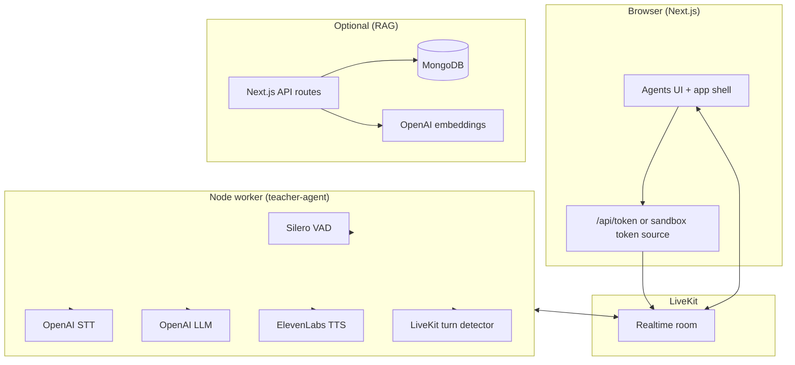

# LearnMate — LiveKit Voice Tutor (React)

A production-oriented reference application for **real-time voice tutoring** on [LiveKit](https://livekit.io/). The web client is a [Next.js](https://nextjs.org/) application built with [Agents UI](https://livekit.io/ui) and the [LiveKit JavaScript SDK](https://github.com/livekit/client-sdk-js). A co-located **LiveKit Agents** worker implements the conversational “LearnMate” teacher using OpenAI (speech + language), ElevenLabs (synthesis), and Silero VAD with LiveKit’s multilingual turn detector.

Optional **RAG** (retrieval-augmented generation) HTTP routes demonstrate document ingestion, embedding, and vector search backed by **MongoDB**—useful when you want course material or notes available to downstream systems.

<picture>
  <source srcset="./.github/assets/readme-hero-dark.webp" media="(prefers-color-scheme: dark)">
  <source srcset="./.github/assets/readme-hero-light.webp" media="(prefers-color-scheme: light)">
  
</picture>

**Starter templates on other platforms:** [Android](https://github.com/livekit-examples/agent-starter-android) · [Flutter](https://github.com/livekit-examples/agent-starter-flutter) · [Swift](https://github.com/livekit-examples/agent-starter-swift) · [React Native](https://github.com/livekit-examples/agent-starter-react-native)

---

## Table of contents

- [Capabilities](#capabilities)
- [System architecture](#system-architecture)
- [Prerequisites](#prerequisites)
- [Getting started](#getting-started)
- [Environment configuration](#environment-configuration)
- [npm scripts](#npm-scripts)
- [Repository layout](#repository-layout)
- [Application configuration](#application-configuration)
- [Voice agent worker](#voice-agent-worker)
- [Optional RAG APIs](#optional-rag-apis)
- [Agents UI customization](#agents-ui-customization)
- [Security and operations](#security-and-operations)
- [Troubleshooting](#troubleshooting)
- [Contributing](#contributing)
- [License](#license)

---

## Capabilities

| Area              | Details                                                                                                                               |
| ----------------- | ------------------------------------------------------------------------------------------------------------------------------------- |
| **Voice**         | Low-latency duplex audio via LiveKit; STT, LLM, and TTS orchestrated in the worker                                                    |
| **Transcription** | Chat-style transcript UI (Agents UI) with TTS-aligned captions where supported                                                        |
| **Media**         | Configurable camera and screen share (disabled by default in `app-config.ts` for this product skin)                                   |
| **Visualization** | Multiple audio visualizer modes: `bar`, `grid`, `radial`, `wave`, `aura`                                                              |
| **Theming**       | Light/dark themes with system preference; brand colors and logos via config                                                           |
| **Dispatch**      | Explicit agent name (`AGENT_NAME` / `agentName`) aligned with [agent dispatch](https://docs.livekit.io/agents/server/agent-dispatch/) |

---

## System architecture



**Data flow (voice lesson):** the client obtains a short-lived access token, joins a LiveKit room, publishes microphone audio, and subscribes to the agent’s audio and metadata tracks. The worker connects as the agent participant, runs the `voice.AgentSession` pipeline, and streams replies back into the same room.

---

## Prerequisites

- **Node.js** 22.x (see `package.json` engines alignment via `@types/node`)
- **pnpm** 9.x (`packageManager` field pins `pnpm@9.15.9`)
- A **LiveKit project** (Cloud or self-hosted) with API key and secret
- **OpenAI** and **ElevenLabs** API keys for the worker
- **MongoDB** URI only if you intend to use the RAG routes

---

## Getting started

You can scaffold a fresh copy with the LiveKit CLI, or clone this repository and follow the steps below.

```bash
lk app create --template agent-starter-react
```

### 1. Install dependencies

```bash
pnpm install
```

### 2. Configure secrets

Copy the example environment file and fill in real values:

```bash
cp .env.example .env.local
```

See [Environment configuration](#environment-configuration) for the full variable reference.

### 3. Run the web application

```bash
pnpm dev
```

Open [http://localhost:3000](http://localhost:3000).

### 4. Run the voice agent worker

In a **second** terminal (the UI will not hear an agent until a worker is connected and dispatched):

```bash
pnpm agent:dev
```

For production-style execution:

```bash
pnpm agent:start
```

### 5. (Optional) One-click sandbox

To evaluate without local LiveKit wiring, use [LiveKit Cloud Sandbox](https://cloud.livekit.io/projects/p_/sandbox/templates/agent-starter-react) for a hosted pairing of infrastructure and template.

[](https://cloud.livekit.io/projects/p_/sandbox/templates/agent-starter-react)

---

## Environment configuration

Variables are read from **`.env.local`** at the project root (the worker loads the same file via `dotenv`).

| Variable                            | Required by                | Purpose                                                                                                                |
| ----------------------------------- | -------------------------- | ---------------------------------------------------------------------------------------------------------------------- |
| `LIVEKIT_API_KEY`                   | Next.js `/api/token`       | Server-side signing of participant tokens                                                                              |
| `LIVEKIT_API_SECRET`                | Next.js `/api/token`       | Secret for JWT signing                                                                                                 |
| `LIVEKIT_URL`                       | Next.js `/api/token`       | WebSocket URL returned to the client (for example `wss://<subdomain>.livekit.cloud`)                                   |
| `AGENT_NAME`                        | Next.js + worker           | Must match the worker’s registered name for [explicit dispatch](https://docs.livekit.io/agents/server/agent-dispatch/) |
| `OPENAI_API_KEY`                    | Worker; RAG routes if used | LLM, STT, and embeddings                                                                                               |
| `ELEVEN_API_KEY`                    | Worker                     | Text-to-speech                                                                                                         |
| `ELEVENLABS_VOICE_ID`               | Worker                     | Voice selection                                                                                                        |
| `OPENAI_LLM_MODEL`                  | Worker                     | Override default LLM (default `gpt-4.1-mini`)                                                                          |
| `OPENAI_STT_MODEL`                  | Worker                     | Override STT model                                                                                                     |
| `ELEVENLABS_MODEL`                  | Worker                     | Override TTS model                                                                                                     |
| `AGENT_LANGUAGE`                    | Worker                     | Spoken language code                                                                                                   |
| `MONGODB_URI`                       | RAG only                   | MongoDB connection string                                                                                              |
| `NEXT_PUBLIC_CONN_DETAILS_ENDPOINT` | Client (optional)          | When set, the app uses the sandbox token helper instead of `/api/token`                                                |
| `NEXT_PUBLIC_APP_CONFIG_ENDPOINT`   | Client (optional)          | Remote app configuration endpoint                                                                                      |
| `SANDBOX_ID`                        | Client (optional)          | LiveKit Cloud Sandbox identifier                                                                                       |

Local LiveKit dev defaults (when running `livekit-server --dev`) are documented inline in [`.env.example`](./.env.example).

---

## npm scripts

| Script                      | Description                                           |
| --------------------------- | ----------------------------------------------------- |
| `pnpm dev`                  | Next.js development server (Turbopack)                |
| `pnpm build`                | Production build                                      |
| `pnpm start`                | Serve the production build                            |
| `pnpm lint`                 | ESLint (Next.js config)                               |
| `pnpm format`               | Prettier write                                        |
| `pnpm format:check`         | Prettier check (CI-friendly)                          |
| `pnpm agent:dev`            | Run the teacher worker in development                 |
| `pnpm agent:start`          | Run the teacher worker in production mode             |
| `pnpm agent:download-files` | Pre-download Silero / model assets for the worker     |
| `pnpm shadcn:install`       | Refresh pinned Agents UI components from the registry |

---

## Repository layout

```
.
├── agent/
│   └── teacher-agent.ts      # LiveKit Agents worker (STT / LLM / TTS session)
├── app/
│   ├── api/
│   │   ├── token/            # Participant JWT issuance + dispatch hints
│   │   └── rag/              # Optional upload / embed / search
│   └── …                     # Next.js App Router pages and layout
├── components/
│   ├── agents-ui/            # LiveKit Agents UI primitives and blocks
│   ├── ai-elements/          # Composable AI UI elements
│   ├── app/                  # Product-specific shell (session, welcome, theme)
│   └── ui/                   # shadcn/ui primitives
├── hooks/                    # React hooks (including Agents UI visualizers)
├── lib/                      # Shared utilities and RAG Mongo helper
├── public/                   # Static assets (logos, marks)
├── app-config.ts             # Typed branding and feature flags
└── package.json
```

**Convention:** orchestration and view state for the lesson experience live under `components/app/`. Treat `components/agents-ui/` as **vendor-adjacent** UI—customize via props and Tailwind first, then fork source when behavior must change.

---

## Application configuration

[`app-config.ts`](./app-config.ts) exports a typed `AppConfig` consumed by the client shell. Adjust:

- **Branding:** `companyName`, `pageTitle`, `pageDescription`, `logo`, `accent`, dark variants
- **Features:** `supportsChatInput`, `supportsVideoInput`, `supportsScreenShare`, `isPreConnectBufferEnabled`
- **Audio UI:** `audioVisualizerType` and related dimensional parameters
- **Dispatch:** `agentName` (defaults from `process.env.AGENT_NAME` with fallback `teacher`)

Audio visualizer modes behave as follows:

| `audioVisualizerType` | Behavior                                                   |
| --------------------- | ---------------------------------------------------------- |
| `bar`                 | Vertical bar spectrum; tune with `audioVisualizerBarCount` |
| `grid`                | Dot matrix; row/column counts configurable                 |
| `radial`              | Circular bars; radius and bar count configurable           |
| `wave`                | Oscilloscope-style trace; line width configurable          |
| `aura`                | Shader-style aura; optional hue shift                      |

---

## Voice agent worker

[`agent/teacher-agent.ts`](./agent/teacher-agent.ts) defines a single `defineAgent` entrypoint:

1. **Prewarm** — loads Silero VAD once per process for reuse.
2. **Entry** — connects to the job context, waits for the first participant, constructs `voice.AgentSession` with OpenAI STT/LLM, ElevenLabs TTS, LiveKit turn detection, and starts the session against the room.
3. **First reply** — generates a short LearnMate greeting that asks for topic and level.

Model identifiers and voice settings are intentionally driven by environment variables so you can promote configuration across environments without code changes.

---

## Optional RAG APIs

HTTP routes under `app/api/rag/` illustrate a minimal ingestion and retrieval pipeline:

| Route           | Role                                                  |
| --------------- | ----------------------------------------------------- |
| `POST …/upload` | Accept document uploads, extract text, chunk, persist |
| `POST …/embed`  | Generate embeddings for stored chunks                 |
| `POST …/search` | Query by embedding similarity                         |

These routes expect `MONGODB_URI` and reuse `OPENAI_API_KEY`. They are **orthogonal** to the voice worker: wire them into your own agent or server logic if you need grounded answers over private corpora.

---

## Agents UI customization

Agents UI components mirror the shadcn pattern: they accept standard DOM props where the underlying element allows it, so Tailwind classes and event handlers compose naturally.

**Update registry components** (non-destructive when the CLI prompts before overwrite):

```bash
pnpm shadcn:install
```

**Add individual components:**

```bash
pnpm dlx shadcn@latest add @agents-ui/<component-name>
```

Session wiring example: wrap the tree in `AgentSessionProvider` and construct a `TokenSource` as in [`components/app/app.tsx`](./components/app/app.tsx).

---

## Security and operations

- **Token minting** — [`app/api/token/route.ts`](./app/api/token/route.ts) validates origin, applies a lightweight rate limit, and signs short-lived grants. Keep API keys only on the server; never embed secrets in client bundles.
- **Agent dispatch** — `AGENT_NAME` in the client config must match the name registered by the worker (`WorkerOptions.agentName`) or dispatch will not attach your worker to new rooms.
- **Dependencies** — Pin upgrades deliberately; the voice stack is sensitive to breaking changes across `@livekit/agents`, plugins, and `livekit-client`.

---

## Troubleshooting

| Symptom                      | Likely cause                             | Mitigation                                              |
| ---------------------------- | ---------------------------------------- | ------------------------------------------------------- |
| UI connects but silent agent | Worker not running or wrong `AGENT_NAME` | Run `pnpm agent:dev` and align env with `app-config.ts` |
| 403 / failed token           | Origin validation or missing LiveKit env | Check `LIVEKIT_*` values and request origin             |
| RAG 500 on boot              | Missing `MONGODB_URI`                    | Set URI or disable routes behind feature flag           |
| Model errors at runtime      | Invalid model ID or quota                | Verify OpenAI / ElevenLabs dashboards                   |

---

## Contributing

Issues and pull requests are welcome. For broader LiveKit questions, join the [LiveKit Community Slack](https://livekit.io/join-slack).

---

## License

This project is licensed under the [MIT License](./LICENSE).

Copyright (c) LiveKit, Inc. See [LICENSE](./LICENSE) for the full text.
